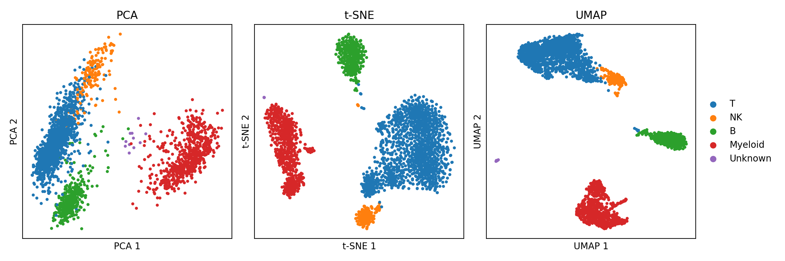

_AI helped write this but it's 90% (including review) me, 10% AI to organize it._

> I haven't published yet. This is me organizing what I've learned so far. If something here is wrong, tell me.

A checklist for running experiments that hold up under review — compiled from reading OpenReview discussions and scouring the internet.

---

## 0. Jargon, Explained from First Principles

Research papers assume you know these terms. Here they are in plain language.

**Seed** — Most of our training code involves random operations: random weight initialization, random data shuffling, random dropout masks. A seed is a number that fixes all of these random values, so that if you run the same code with the same seed, you get the exact same result. This matters because we need to train with 2–3 different seeds and check: did our model succeed because of a lucky seed, or because our idea actually works? If results only hold on seed 42 but fall apart on seed 43 and 102, the result was noise, not signal.

**Baseline** — The best performing model from previous work in the literature that you are comparing against. Your improvement only means something relative to a strong baseline. If you beat a weak baseline, reviewers will ask why you didn't compare against the obvious stronger one.

**Inductive bias** — The assumptions baked into your model architecture or training procedure that guide it toward certain solutions. A convolutional neural network has an inductive bias toward local spatial patterns. A transformer has an inductive bias toward attending to relationships across the full sequence. An RNN has an inductive bias toward sequential processing. When we say "our idea works," we often mean "the inductive biases we chose are well-suited to this problem." It is the assumption you make about why your method works.

**Ablation study** — Systematically removing one component at a time from your model to measure its contribution. If your model has components A + B + C and you remove A and performance drops significantly, then A was important and earns its place. If you remove B and nothing changes, B was dead weight — drop it or explain why it's there. Reviewers will always ask for this.

**Downstream task** — The real test of your learned representations. You pretrained your model to learn general features from raw data, and now you evaluate whether those features are actually useful for specific tasks: speech recognition, emotion classification, speaker identification, etc. The quality of your representations is measured by how well they transfer to tasks they were never explicitly trained for.

**Data Manifests / splits** — The lists that define which data files go into which bucket. Train split is what the model learns from. Validation split is what you monitor during training to detect overfitting. Test split is the final exam — touched once, at the very end, to report your numbers. Changing splits mid-experiment invalidates all prior results.

**Hyperparameters** — Configuration choices you make before training begins: learning rate, batch size, number of layers, latent dimension, loss weights, etc. The model does not learn these — you set them. Finding good hyperparameters is called **hyperparameter tuning** or **sweeping** (more on this later).

**Reconstruction loss** — How well your model can rebuild its input. Feed in audio, encode it into a compact representation, decode it back to audio — how close is the output to the original? Lower loss means better reconstruction, though low reconstruction loss alone does not guarantee good representations (more on this in the sanity checks).

**Latent space** — The compressed internal representation space of your model. When an autoencoder squeezes audio into a small vector, that vector _lives_ in the latent space. A good latent space organizes similar things close together — similar speakers should cluster, similar emotions should cluster. If the latent space is a uniform blob with no structure, the model has not learned meaningful features.

**Collapse** — When the model finds a degenerate shortcut and maps all (or most) inputs to the same output representation. Mathematically, the simplest case is when weights go to zero so everything maps to the zero vector. But collapse can also happen in subtler ways — the model might use only a few dimensions of the latent space and ignore the rest (dimensional collapse), or it might map all inputs to a small region rather than exactly zero. The common thread is that the representations lose the ability to distinguish between different inputs. More on detecting this below.

**Checkpoint** — A saved snapshot of your model's weights at a particular point during training. Since training can take hours or days, we save checkpoints periodically (say, every epoch or every 5000 steps). This way, if training crashes, you don't lose everything. More importantly, checkpoints let you go back and evaluate or do inference on the model at different stages of training, which is essential for debugging and qualitative analysis.

**Wandb (Weights & Biases)** — An experiment tracking tool. The name comes from the two core things you care about in neural networks: the weights (W) and the biases (B = WandB). Wandb logs your training curves, hyperparameters, system metrics, and outputs to a cloud dashboard so you can compare runs, share results, and go back to any experiment months later. There are alternatives (MLflow, TensorBoard), but wandb has become the most common in recent research. Wandb and similar tools is the most useful thing you can add and it's very simple to setup.

---

## 0. The Tooling/Automation

A lot of the practices described below are tedious if done manually, but much of it can be automated.

**Experiment tracking:** wandb (already mentioned)

**Config management**: Use YAML config files instead of hardcoding hyperparameters. Override specific values from the command line for experiments (Hydra does this). This makes it trivial to reproduce any run — the config file IS the documentation of what you did.

**Hyperparameter sweeps**: A hyperparameter sweep is a systematic search over combinations of hyperparameters to find the best configuration. For example, you might try learning rates of [1e-4, 3e-4, 1e-3] combined with batch sizes of [16, 32, 64] — that's 9 combinations to train and compare. A **grid sweep** tries all combinations exhaustively. A **random sweep** samples randomly from defined ranges, which is often more efficient than grid search for high-dimensional spaces. **Bayesian sweeps** (used by tools like Optuna or wandb sweeps) use the results of previous runs to intelligently choose what to try next — if a learning rate of 3e-4 worked well, the algorithm explores nearby values rather than wasting time on clearly bad regions. This can find good configurations faster than either grid or random search. Sweeps are expensive, which is why the convention is to borrow baseline hyperparameters from the literature and only sweep the new parameters your method introduces.

**Libraries**: Tools like Optuna (hyperparam sweep), wandb sweeps (hyperparam sweep), and Hydra (config) can handle much of the experiment management overhead. The less manual bookkeeping you do, the fewer mistakes you make.

**Scripting:** I created my own scripts that automate the things I want. For example, if I start a run with manually overridden hyperparams, it always creates a new folder that contains the information of the training run along with the Wandb ID. I also store a YAML file that tracks any manual values with the Wandb ID so I can have a quick look for the manual experiments.

My setup:

```
runs/
  exp0/
    index.yaml              ← human-readable map
    seed_42/                ← clean run
    seed_42_a3f8c1/         ← override run
    seed_42_a3f8c1_20260212_143022/  ← same overrides, run twice

index.yaml will look like:
  seed_42_a3f8c1:
      model.bottleneck.latent_dim: '512'
  seed_42_b91d4e:
      loss.sigreg.weight: '0.5'
      loss.jepa.weight: '2.0'
```

---

## 1. The Philosophy

This is the scientific method applied to deep learning. Nothing fancy:

1. **Hypothesis** — "I think X will improve Y because Z." Write this down before training. Not after you see the results. Your lab notebook should have this sentence dated.

2. **Control** — A strong, reproducible baseline from the literature.

3. **Treatment** — Your new idea, with as few changes from the control as possible.

4. **Observation** — Compare control vs. treatment on the same metrics, same data, same compute budget.

5. **Ablation** — Prove every component earns its place. Test with and without your modifications to see what actually worked.

6. **Significance** — Multiple seeds. If your result flips with a different seed, it was not a result.

Most papers I've seen rejected on OpenReview were not rejected because the idea was bad. They were rejected because the experiments didn't convincingly support the claims.

---

## 2. Conventions I've Observed (and Questions I Still Have)

These are patterns I've noticed across papers and reviews. Some I'm confident about, others I'm still figuring out.

> **The SSL Training Split Convention**

This one confused me initially but it seems to be standard practice: **Self-supervised learning (SSL)** models — like wav2vec 2.0, HuBERT, or data2vec for speech — train on the **entire dataset** without labels. The model learns structure from raw audio alone (predicting masked frames, etc.), so there's no need for a train/val/test split during pretraining. But for **downstream evaluation**, you freeze the pretrained encoder and train a small task-specific head (a linear layer or small MLP) using the labeled train split, validate on the val split, and report numbers on the test split.

```
Pretraining:
[========== ALL DATA, no labels ==========]
                              ↓
Downstream:   [train | val | test]  ← labels used here
                              ↑
                    report THIS number
```

From what I've seen, this is universally followed in SSL speech papers. It makes sense — the whole point of SSL is that representations should transfer to held-out tasks and data they weren't explicitly optimized for.

Though I wonder: does pretraining on all data, including what later becomes the downstream test set, introduce a subtle advantage? The model has "seen" that audio during pretraining even without labels. Most papers seem to accept this as fine since no label information leaked, but it's worth thinking about.

> **The "Borrow Your Baseline" Convention**

Hyperparameter sweeps are expensive (see the tooling section at the end for what a sweep actually is). A full grid search on a large model can cost thousands of GPU hours that most of us don't have.

So the convention seems to be: **take the baseline hyperparameters directly from the original paper or established prior work**, and only sweep the hyperparameters specific to your new contribution. Example:

- You're proposing a new auxiliary loss for speech SSL
- You do NOT re-sweep learning rate, batch size, warmup steps, or encoder architecture — you use the same settings from the HuBERT or wav2vec 2.0 paper and cite them
- You only sweep the new knobs your method introduces (your loss weight λ, your masking strategy, etc.)

This makes sense practically and scientifically. It keeps the comparison fair — you're isolating your contribution from hyperparameter tuning effects. Reviewers will ask "is the improvement from your method or from better hyperparameter tuning?" if you touched too many knobs.

I'm still curious though: what if the original paper's hyperparameters are suboptimal for your new method? Do you just accept the handicap for fairness? From what I've read, the answer seems to be yes for the main comparison, but you can include a supplementary experiment with tuned hyperparameters and note it.

> **The "Same Compute Budget" Convention**

If your model trains for 400K steps and the baseline trains for 100K steps, it's not a fair comparison. Either:

- Train both for the same number of steps, OR
- Train both for the same wall-clock time, OR
- Explicitly report compute cost and acknowledge the difference

And yet — I've seen papers accepted at major venues that don't report compute costs at all. No GPU type, no training hours, nothing. How do you assess efficiency or reproducibility without this information? Some papers even omit which dataset split they used for certain results. It seems like enforcement of these norms is inconsistent, which is frustrating for someone trying to learn what "proper" looks like.

Maybe the bar is rising and these omissions will become less acceptable over time. Either way, reporting compute cost seems like it should be table stakes.

---

## 3. Directory Structure — Organize by Hypothesis, Not by Date

"run_47" means nothing in three months. Name experiments by what they test. My setup was described above which is a bit more complex.

```
runs/
  ├── exp0_baseline_hubert/       # the control
  │     ├── seed_42/
  │     ├── seed_43/
  │     └── seed_44/
  ├── exp1_new_masking/           # the treatment
  │     ├── seed_42/
  │     ├── seed_43/
  │     └── seed_44/
  └── ablations/
        ├── no_auxiliary_loss/
        └── smaller_codebook/
```

---

## 4. Workflow

> **Phase 1: Establish the Baseline**

Before testing a new idea, you need a baseline you trust. A common question (that I had): is the baseline your own reproduction of someone else's model, or is it their reported numbers? From what I've gathered, it depends:

- **Ideally**, you reproduce the baseline yourself using their published code and hyperparameters, and verify your numbers roughly match theirs. This ensures identical evaluation protocols.
- **If reproduction is too expensive**, you can compare against their reported numbers, but you must use the exact same evaluation protocol and dataset. Any difference in eval setup invalidates the comparison.
- **In some SSL speech papers**, the "baseline" is also the pretrained model you start from (e.g., a HuBERT checkpoint), and your contribution is a modification to the architecture or training objective.

Run the baseline with 3 seeds to measure variance:

```bash
python train.py --config configs/baseline.yaml --seed 42 --run_id baseline_s42
python train.py --config configs/baseline.yaml --seed 43 --run_id baseline_s43
python train.py --config configs/baseline.yaml --seed 44 --run_id baseline_s44
```

If your 3 seeds give you 78%, 82%, 71% — that's a variance of over 10 points. Your training is unstable and needs to be fixed before adding any complexity. A stable baseline might look like 80.1%, 80.4%, 79.8%.

For development and debugging, 1 seed is fine. The 3-seed runs are for final numbers. GPU hours are a real constraint — I'm currently training on a GTX 1660 Super, so I think about this constantly.

> **Phase 2: Changing One Thing at a Time**

The best practice from what I've read is clear: change exactly one variable between your baseline and your experiment. This isolates the effect of your contribution. In practice, I suspect this is harder to follow strictly than papers make it look. Sometimes a new loss function requires a different learning rate to be stable, or a new architecture component changes the optimal batch size. The key insight seems to be: if you changed multiple things and got improvement, you need ablations to disentangle which change actually helped.

```bash
python train.py --config configs/baseline.yaml \
  --new_masking_ratio 0.65 \
  --seed 42 \
  --run_id new_masking_s42
```

> **Phase 3: Evaluate Properly**

Evaluation should be automated and identical across all runs. For speech SSL, the standard evaluation protocol involves:

- **ASR (Automatic Speech Recognition)** — fine-tune or train a linear head on the frozen representations, measure WER (word error rate) on the test set
- **Speaker identification** — does the model capture speaker characteristics?
- **Emotion recognition** — can a probe detect emotion from the representations?
- **Reconstruction quality** — if applicable, spectral loss, SI-SDR, or other signal-level metrics

```bash
python eval/run_all.py \
  --checkpoint runs/baseline_s42/best.pt \
  --eval_data data/test.jsonl \
  --output runs/baseline_s42/eval_results/
```

The same evaluation script, same data, same metrics for every single run. No exceptions.

> **Phase 4: Ablations**

If your method has components A + B + C, you need a table like this:

| Configuration      | WER ↓ |
| ------------------ | ----- |
| Full model (A+B+C) | 18.2  |
| Without A          | 20.0  |
| Without B          | 18.4  |
| Without C          | 21.7  |

Reading this table: removing C causes the biggest performance drop (+3.5 WER), so C is the most important component. Removing A hurts noticeably (+1.8). Removing B barely matters (+0.2) — which means B might not be earning its place. If B also adds computational cost, an honest paper would note this and potentially recommend dropping it.

---

## 5. Sanity Checks

Before trusting any result, verify these:

**No data leakage between splits.** If the same sample (or closely related samples) appears in both training and evaluation, you're measuring memorization. Use data auditing to help curb this.

**Low loss ≠ good model.** A model can minimize reconstruction loss through trivial shortcuts without learning anything useful. Visualize your latent space (PCA, UMAP). If semantically similar inputs don't cluster together, the model hasn't learned meaningful structure.

This is what a UMAP/PCA graph looks like:



**Watch for collapse.** Monitor the standard deviation of your embeddings during training. If it trends toward zero, the model is mapping everything to the same representation. This isn't just an SSL problem — it can happen in autoencoders, GANs (mode collapse), and even supervised models. Kill the run early if you see it.

**Look at your outputs, not just your metrics.** Save checkpoints during training and run inference on them. Look at what the model actually produces. Metrics can improve while output quality degrades in ways numbers don't capture. For downstream probes, log the actual predictions — not just the aggregate score. I personally automate this at certain steps (5k, 10k, 15k) and log them in Wandb. This is another win for Wandb.

**Hardware shouldn't change results.** If switching GPUs or changing the number of devices produces different results, there's likely a bug in batch normalization, gradient accumulation, or precision handling. On my GTX 1660 Super, AMP\* (Automatic Mixed Precision) caused failures so I train in fp32 for now — that's fine for prototyping on consumer hardware.

---

## 6. Data Is the Experiment

> **Fixed Splits Are Sacred**

Generate your train/val/test splits once. Checksum them. Commit the splits/list of files (not the actual data) to version control. Do not modify them during a study.

```bash
python scripts/create_splits.py \
  --data_dir /path/to/audio \
  --output_dir data/splits/v1 \
  --val_frac 0.05 \
  --test_frac 0.05 \
  --seed 42
```

If you change your splits mid-experiment, every previous result is invalidated.

> **Data Quality Matters More Than You Think**

Before training, audit your data. In audio/speech, common issues include:

- **Silence or near-silence** — files that are mostly quiet, wasting training compute and skewing metrics
- **Clipping / distortion** — audio recorded too loud, where the waveform is flattened at maximum amplitude
- **Duplicates or near-duplicates** — the same recording appearing multiple times, which can cause train/test leakage even with proper splitting

There are many ways to audit for these issues — SNR estimation, silence detection, spectral analysis, embedding-based similarity checks. Data quality issues are much cheaper to fix before training than to debug after.

> **Data Contamination**

If your training data contains your evaluation data (or close paraphrases of it), your evaluation numbers are inflated. For speech SSL, this is less of a concern than in text-based work, but it's still worth verifying:

- Are any of your test utterances duplicated in the training set?
- If using a public dataset, are you using the official splits?
- Document which version of the dataset you used and what filtering was applied

---

## 7. The Pre-Flight Checklist

**Before First Experiment**

- [ ] Seeds are set and logged (torch, numpy, random, CUDA determinism)
- [ ] Dependencies are pinned (requirements.txt, uv.lock, etc.)
- [ ] Experiment tracking is configured (wandb or equivalent)
- [ ] Data splits are generated, fixed, checksummed, and documented
- [ ] You can reproduce a short run from a cold start on a clean environment
- [ ] Baseline config (from baseline experiment) is committed to version control, to ensure fair comparison (optional)
- [ ] Lab notebook started, AI can maintain this (date + hypothesis + outcome, even for failed runs)

**During Training**

- [ ] Full config logged to tracker
- [ ] Loss curves monitored, not just final numbers
- [ ] Collapse indicators tracked (embedding std, gradient norms)
- [ ] Checkpoints saved at regular intervals for evaluation probes
- [ ] Qualitative outputs checked manually periodically (listen to reconstructions, read ASR probe outputs)
- [ ] Failed runs logged — negative results are data

**Before Writing Up Results**

- [ ] 3+ seeds for all main results, reported as mean ± std
- [ ] Ablation study with each component removed individually
- [ ] Baselines from literature reproduced or cited with matching eval protocol
- [ ] Compute costs reported (GPU type, hours)
- [ ] Qualitative examples included alongside quantitative tables
- [ ] Limitations section written honestly
- [ ] Code and configs ready for release (or pseudocode in appendix)

---

## 8. Common Reviewer Concerns

**"The baseline is weak"** — Use the strongest known baseline from recent work. Cite it. Reproduce it if feasible.

**"Only one seed"** — 3 seeds minimum for main results. Report mean ± standard deviation, not the best run.

**"No ablation"** — If your method has N components, you need N ablation rows.

**"Unfair comparison"** — Same compute, same data, same evaluation protocol. Any difference must be explicitly stated.

**"Improvement is within noise"** — If your improvement is 0.3% and your cross-seed std is 0.5%, that's not a meaningful improvement.

**"No qualitative results"** — Numbers alone are not sufficient. Include spectrograms, reconstructed audio examples, or latent space visualizations.

**"Compute cost not reported"** — And yet, papers get accepted without this information all the time. How? It's inconsistent. I think the field is slowly getting better about this, but it's still not universally enforced. Report it anyway — it costs nothing and helps everyone.

---

## 9. Closing Thoughts

The bar for top venues is not magic. It's rigor. From everything I've read on OpenReview, most rejected papers have reasonable ideas — they're rejected because the experiments don't convincingly support the claims. Missing ablations, weak baselines, single seeds, no compute budgets, no qualitative analysis.

The boring methodological work is what separates a solid submission from a desk rejection.

I'm still learning all of this. If you've been through the review process and something here is wrong or incomplete, I'd like to know.

_This guide reflects my current understanding from reading papers, reviews, and discussions — not from publishing experience. Take it as a starting point, not gospel.\*_

---

**\*AMP (Automatic Mixed Precision)** — A technique that uses 16-bit floating point numbers (half precision) instead of 32-bit for **parts** of the computation during training. This can nearly halve memory usage and speed up training on modern GPUs that have dedicated hardware for fp16 math. The "automatic" part means the framework (PyTorch, for example) decides which operations can safely use 16-bit and which need to stay at 32-bit to maintain numerical stability. Not all setups support it cleanly — I tried enabling AMP on my GTX 1660 Super and it caused failures, so I turned it off for now. It's not a priority since I'll eventually move to my lab's GPUs where it should work fine, but it's worth knowing about since it can meaningfully reduce training time and memory.
