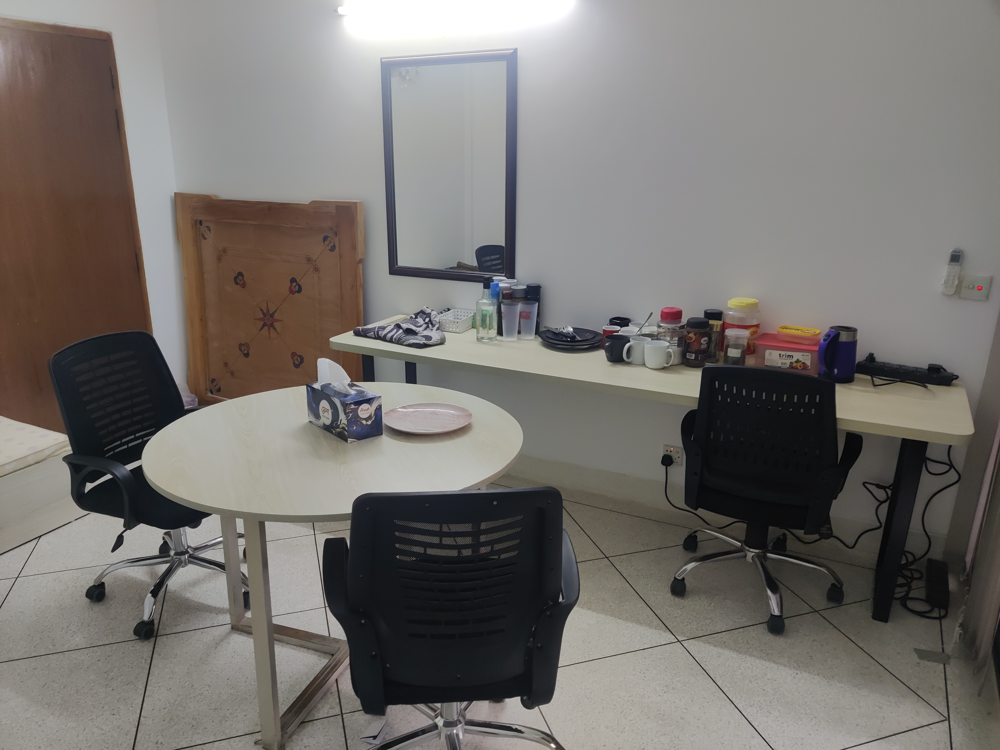

import PanZoomImage from '../../../components/PanZoomImage.astro'
import jobTimeline from './job-timelin.png'

Hi everyone! I'm a software engineer with over 4 years of professional experience. I've worked across the stack - from backend to frontend to a bit of cloud infrastructure - at companies ranging from early-stage startups catering to consumers to enterprise SaaS platforms serving Fortune 100 clients.

What drives me: making sure my work moves towards actual tangible results and delights users.

Here's a diagram of my timeline, it has some extra info you may not need:

## <PanZoomImage src={jobTimeline.src} alt="Career Timeline" height="450px" />

## Optimizely (2024-2025)

**Full Stack Software Engineer** | Content Marketing Platform

Joined the product development team at Optimizely's Content Marketing Platform - an enterprise SaaS tool used by companies like Shell and Xerox.

**Highlights:**

- Owned the [Custom URL feature](/post/portfolio/optimizely-custom-url) end-to-end - backend, AWS Lambda, and infrastructure setup that serves over a million requests/day and wrote extensive documentation to support maintenance
- Built features to streamline workflow management, track feature adoption, generate data reports all in all improving user retention and engagement
- Wrote tests and documentation/tech specs to unblock features, so that team can focus on more impactful projects
- Resolved 4 SLA-bound customer issues, saving >$10,000 on each resolved issue

I got this role despite lacking formal backend experience. Self-studied backend engineering through projects and courses, and performed well in system design interviews.

---

## GoZayaan (2022-2024)

**Software Engineer 2, Frontend** | Travel Tech Platform

GoZayaan is one of Bangladesh's leading travel platforms. I closed 154 PRs in 11 months - averaging 14 PRs/month.

**Highlights:**

- Built the [SEO Content Builder](/post/portfolio/gozayaan-seo-builder) - a drag-and-drop page builder that grew organic search traffic from 33k to 116k/month (3.5X increase)
- Contributed heavily to the Vue 2 to Nuxt 2 migration for the main website
- Mentored a teammate through their journey to becoming a full-time junior engineer
- Built the Hotel Map search feature with interactive location-based browsing
- Wrote design docs on frontend code organization and optimization strategies

**Other contributions:** Hotel booking review pages, gift card system, remittance admin dashboard with KYC module, email templates for ticket issuance.

---

## What I'm Exploring Now

Local-first software: Software that doesn't need the cloud to survive.

Audio AI research: Investigating speech processing and audio generation. It's a pivot from my standard software engineering work, driven by genuine curiosity about where the field is heading.

---

## Mistakes I've Learned From

I track my mistakes. Some recurring themes:

- Not taking ownership early enough - waiting for others instead of stepping in

- Overanalyzing instead of shipping small wins and iterating

I'm actively working on these.

---

## Earlier Experience

**Early-Stage Startup**

- Built a cloud saving feature on top of a [lean model canvas generator](https://monhary-canvas.netlify.app/)
- Worked with Postgres and KoaJS

**YY Ventures Design Studio** (Internship)

- Deployed 3 websites using Svelte and React
- Built a medium-scale Jamstack site using Svelte, Astro, and GraphCMS
- Set up GitHub Actions for CI/CD workflows

**Student Tutor, BRAC University**

- Assisted 150 students across 3 sections with Computer Architecture coursework
- Taught IEEE floating-point arithmetic and MIPS Assembly
- Automated grading using Python and Google Sheets API

---

**Want the technical deep-dives?**

- [SEO Content Builder](/post/portfolio/gozayaan-seo-builder) - How I helped grow search traffic 3.5X
- [Custom URL Feature](/post/portfolio/optimizely-custom-url) - Enterprise SaaS at scale
