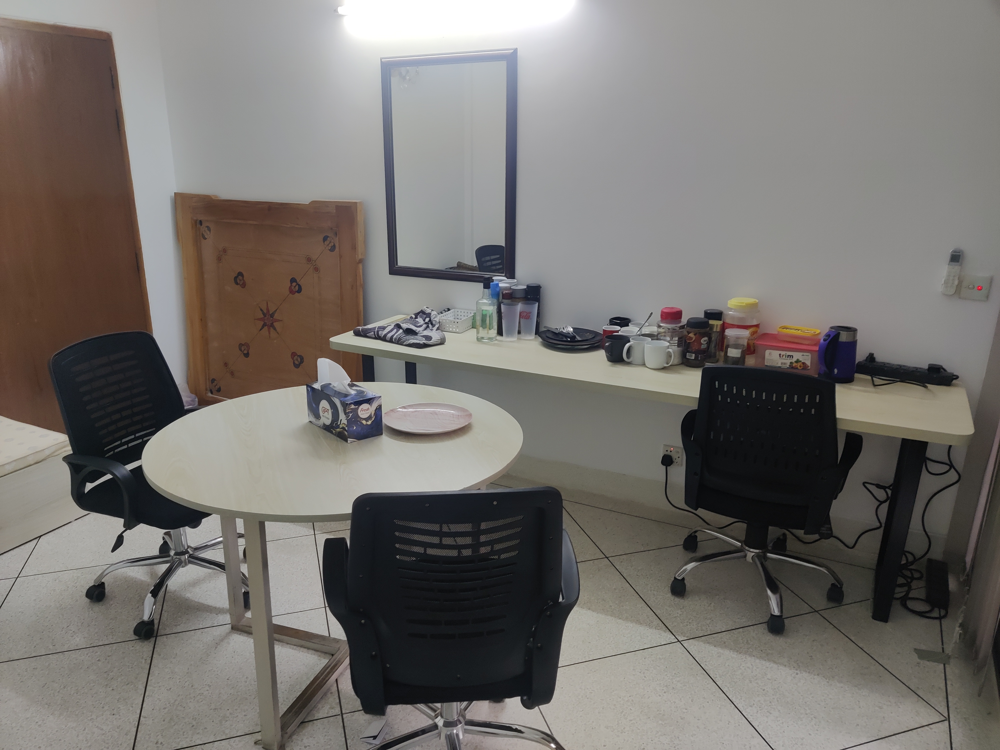

import PanZoomImage from '../../../components/PanZoomImage.astro'
import jobTimeline from './job-timelin.webp'

Hi, I'm Aryan. Over the last ~4 years, I have worked across the stack (frontend, backend, and some infrastructure) in startups and enterprise SaaS.

I focus on work with a clear reason to exist and measurable outcomes (users, reliability, cost, or growth).

## TL;DR

- Enterprise SaaS + travel tech; shipped product + infra work end-to-end.
- Focus on ownership, clear metrics, and incremental delivery.
- Links: [Optimizely Custom URL](/post/portfolio/optimizely-custom-url), [GoZayaan SEO Builder](/post/portfolio/gozayaan-seo-builder).

Timeline overview:

## <PanZoomImage src={jobTimeline.src} alt="Career Timeline" height="450px" />

## Optimizely (2024-2025)

**Full Stack Software Engineer** | Content Marketing Platform

Optimizely is an enterprise SaaS platform serving Fortune 500 companies. I joined the product development team on the Content Marketing Platform — used by companies like Shell and Xerox.

**Highlights:**

- Owned the [Custom URL feature](/post/portfolio/optimizely-custom-url) end-to-end - backend, AWS Lambda, and infrastructure setup that serves over a million requests/day and wrote extensive documentation to support maintenance
- Built features to streamline workflow management, track feature adoption, and generate data reports to improve retention and engagement
- Wrote tests, documentation, and technical specs to unblock delivery and reduce support overhead
- Resolved 4 SLA-bound customer issues, saving >$10,000 on each resolved issue

Joined this role without formal backend experience; backend skills were developed through projects, coursework, and system design preparation.

---

## GoZayaan (2022-2024)

**Software Engineer 2, Frontend** | Travel Tech Platform

GoZayaan is Bangladesh's largest online travel agency ($8.1M raised, Wavemaker-backed), with operations in Singapore, Pakistan, and Sri Lanka. Contributed 154 PRs in 11 months (about 14 PRs/month).

**Highlights:**

- Built the [SEO Content Builder](/post/portfolio/gozayaan-seo-builder) - a drag-and-drop page builder that grew organic search traffic from 33k to 116k/month (~3.5x)
- Contributed heavily to the Vue 2 to Nuxt 2 migration for the main website
- Mentored a teammate through their journey to becoming a full-time junior engineer
- Built the Hotel Map search feature with interactive location-based browsing
- Wrote design docs on frontend code organization and optimization strategies

**Other contributions:** Hotel booking review pages, gift card system, remittance admin dashboard with KYC module, email templates for ticket issuance.

### Proof (search traffic growth)

Source: Semrush (monthly organic traffic).

---

## Notable Personal Projects

1. [Relearnify](/post/portfolio/relearnify)

2. [Currency Converter Pro](/post/portfolio/currency-converter)

---

## What I'm exploring now

Local-first software: Software that doesn't need the cloud to survive.

Audio AI research: Investigating speech processing and audio generation as an extension of core software engineering work.

---

## Mistakes I've learned from

Some recurring themes:

- Not taking ownership early enough - waiting for others instead of stepping in

- Overanalyzing instead of shipping small wins and iterating

These are active improvement areas.

---

## Earlier Experience

**Shotero**

- Built a cloud saving feature on top of a [lean model canvas generator](https://monhary-canvas.netlify.app/)
- Worked with Postgres and KoaJS

**YY Design Studio** (Internship)

- Developed and deployed 4 web landing pages for social businesses, bringing $2,000+ in revenue
- Supported deployment of 3 legacy PHP websites and used GitHub Actions for CI/CD

**Student Tutor, BRAC University**

- Assisted 150 students across 3 sections with Computer Architecture coursework
- Taught IEEE floating-point arithmetic and MIPS Assembly
- Automated grading using Python and Google Sheets API

---

**Want the technical deep-dives?**

- [SEO Content Builder](/post/portfolio/gozayaan-seo-builder) - How I helped grow search traffic 3.5X
- [Custom URL Feature](/post/portfolio/optimizely-custom-url) - Enterprise SaaS at scale
