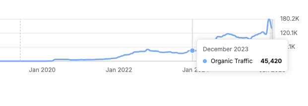
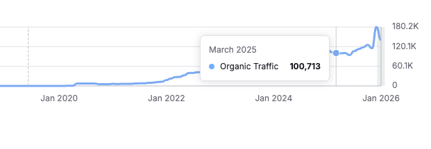

Marketing wanted to ship SEO landing pages fast. Engineering time was the bottleneck. I built a page builder so they could publish without breaking SEO.

## TL;DR

- Built a drag-and-drop page builder + reusable block library in our Nuxt app.
- Auto-generated JSON-LD (FAQPage, etc.) so non-engineers didn’t have to think about schema details.
- Unblocked SEO page production while keeping guardrails (validation, sane defaults, “boring” UX).

**My Role:** Software Engineer 2 (Frontend)

**Tech Stack:** `Vue.js` `Nuxt.js` `JSON-LD / Structured Data`

**At a glance:** Internal tool for marketing, shipped in production, used to publish SEO landing pages (destinations, deals, guides).

## Why we needed this

At GoZayaan, marketing was doing the right thing: publish lots of targeted pages for search. The problem was the workflow.

Every new SEO page was “a ticket for engineering”, which meant:

- pages got stuck behind real product work,
- content iteration was slow,
- and engineers were spending time on repetitive layout work instead of product.

We didn’t need a fancier CMS. We needed leverage: **a constrained builder that made the “right” thing easy** (and the wrong thing hard).

## What I built (what it actually did)

The builder was basically: “pick a block, fill fields, reorder, publish”.

## Demo (builder UI)

- **A small block library** (hero, cards, CTAs, tables, FAQ, etc.) built out of existing design system patterns.
- **Duplication / templating** so a new page started from a known-good baseline.
- **Image picker** hooked into our existing asset/CDN flow.
- **Preview + validation** (lightweight, but enough to prevent obvious foot-guns).

The most important part (and the part I cared about the most): **structured data was automatic.**

If someone adds an FAQ block, the page gets `FAQPage` JSON-LD. If they don’t add it, it doesn’t. Nobody on the marketing team had to memorize schema rules or worry about formatting.

## The parts that were harder than they sound

### 1) Editable tables (I underestimated this)

Tables are deceptively annoying. Everyone expects it to feel like Notion/Sheets, but under the hood you still need a stable data model you can save, version, and render reliably.

I ended up moving to a normalized representation (cells keyed by coordinates) instead of trying to keep nested arrays perfectly in sync with the UI. That made persistence and “copy/paste-ish” behaviors much less fragile.

### 2) Making it boring (on purpose)

This is a real constraint for internal tools: if the UI is clever, adoption drops.

So the builder intentionally avoided “power user” affordances that would confuse people. Fewer features, fewer states, fewer ways to accidentally publish a broken page.

That was the main tradeoff: **less flexibility now, but higher confidence + adoption.**

### 3) SEO guardrails without slowing people down

The builder had to be fast to use, but I didn’t want it to become a “random HTML generator”.

So we leaned on defaults + validation:

- blocks map to known markup,
- schema is generated from structured inputs,
- and publishing is constrained to known-good patterns.

Not perfect, but it removed a lot of “silent failures” that only show up weeks later in search performance.

## Proof (before/after)

Here are the graphs I used internally to sanity-check that we weren’t just shipping pages — we were actually improving outcomes.

Source: Semrush (monthly organic traffic).

## Result (what changed in the org)

- Marketing could publish without engineering involvement for each page.
- SEO pages became a repeatable workflow instead of a backlog.
- Organic traffic went from ~33k/month to ~116k/month over time (3.5x).

## What went wrong / what I’d do differently

The first version was too permissive. It technically “worked”, but it was easy to create pages that looked fine and still had SEO issues (missing required fields, weird headings, etc.).

If I rebuilt it, I’d spend more time on guardrails up front:

- clearer previews (including a “schema preview” for debugging),
- stricter validation on publish,
- and some opinionated templates for the common page types.

Those are the sharp edges non-engineers run into first — and if they hit too many of them, they’ll stop using the tool.

[Back to Portfolio Overview](/post/portfolio/about-me)
