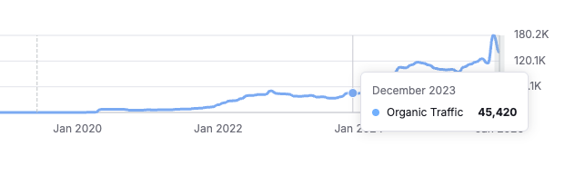
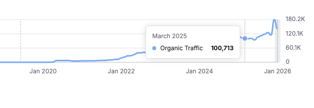

Marketing needed to ship SEO landing pages quickly, but engineering bandwidth was the bottleneck. We built a page builder so pages could be published without breaking SEO.

## TL;DR

- Built a drag-and-drop page builder + reusable block library in our Nuxt app.
- Auto-generated JSON-LD (FAQPage, etc.) so non-engineers didn’t have to think about schema details.
- Unblocked SEO page production while keeping guardrails (validation, sane defaults, “boring” UX).

**My Role:** Software Engineer 2 (Frontend)

**Tech Stack:** `Vue.js` `Nuxt.js` `JSON-LD / Structured Data`

**At a glance:** Internal tool for marketing, shipped in production, used to publish SEO landing pages (destinations, deals, guides).

## Why we needed this

At GoZayaan, marketing was doing the right thing: publish lots of targeted pages for search. The problem was the workflow.

Every new SEO page was “a ticket for engineering”, which meant:

- pages got stuck behind real product work,
- content iteration was slow,
- and engineers were spending time on repetitive layout work instead of product.

We didn’t need a fancier CMS. We needed leverage: **a constrained builder that made the “right” thing easy** (and the wrong thing hard).

## What we built (what it actually did)

The builder was basically: “pick a block, fill fields, reorder, publish”.

## What a page looks like

Live page built with the builder:

[Open Live Page ↗](https://gozayaan.com/route/saint-martin-ship)

- **A small block library** (hero, cards, CTAs, tables, FAQ, etc.) based on existing design-system patterns.
- **Duplication / templating** so a new page started from a known-good baseline.
- **Image picker** hooked into our existing asset/CDN flow.
- **Preview + validation** (lightweight, but enough to prevent obvious foot-guns).

The most important part was that **structured data was automatic.**

If someone adds an FAQ block, the page gets `FAQPage` JSON-LD. If they don’t add it, it doesn’t. Nobody on the marketing team had to memorize schema rules or worry about formatting.

## The parts that were harder than expected

### 1) Editable tables

Tables are deceptively hard. Everyone expects a Notion/Sheets-like experience, but under the hood you still need a stable data model that can be saved, versioned, and rendered reliably.

We moved to a normalized representation (cells keyed by coordinates) instead of trying to keep nested arrays perfectly in sync with the UI. That made persistence and copy/paste behavior much less fragile.

### 2) Making it boring (on purpose)

This is a real constraint for internal tools: if the UI is overly clever, adoption drops.

So the builder intentionally avoided “power user” affordances that would confuse people. Fewer features, fewer states, fewer ways to accidentally publish a broken page.

That was the main tradeoff: **less flexibility now, but higher confidence + adoption.**

### 3) SEO guardrails without slowing people down

The builder had to be fast to use, but we wanted to avoid turning it into an unstructured HTML generator.

So we leaned on defaults + validation:

- blocks map to known markup,
- schema is generated from structured inputs,
- and publishing is constrained to known-good patterns.

This removed many “silent failures” that only show up weeks later in search performance.

## Proof (before/after)

Here are the graphs I used internally to sanity-check that we weren’t just shipping pages — we were actually improving outcomes.

Source: Semrush (monthly organic traffic).

## Result (what changed in the org)

- Marketing could publish without engineering involvement for each page.
- SEO pages became a repeatable workflow instead of a backlog.
- Organic traffic went from ~33k/month to ~116k/month over time (3.5x).

## What went wrong / what I’d do differently

The first version was too permissive. It worked, but it was still easy to create pages that looked fine while having SEO issues (missing required fields, heading problems, etc.).

If we rebuilt it, we would spend more time on guardrails up front:

- clearer previews (including a “schema preview” for debugging),
- stricter validation on publish,
- and some opinionated templates for the common page types.

These are the first sharp edges non-engineers hit, and too many of them reduce adoption.

[Back to Portfolio Overview](/post/portfolio/about-me)
