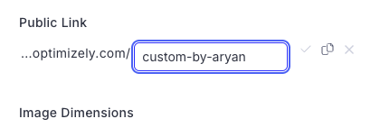
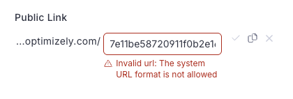

Custom URLs sound like a small routing feature until your “URLs” are served behind CloudFront, across branded domains, and you can’t afford to break caching or ship a redirect loop to enterprise customers.

## TL;DR

- Implemented an edge-first custom URL resolver (CloudFront + Lambda@Edge + DynamoDB) so branded vanity paths resolve without hitting the app unless they should.
- Built validation + guardrails to prevent collisions, reserved system paths, and “looks valid but breaks prod” edge cases.
- Shipped safely via monitoring + staged rollout (with a clean rollback path).

**My role:** Full Stack Software Engineer  
**Tech stack:** `AWS CloudFront` · `Lambda@Edge` · `DynamoDB` · `Python`  
**Scale:** ~1M+ assets/day (plus the fun of global edge behavior)

## What I built (in plain terms)

Users could create a vanity path like `/summer-sale` on a branded domain, and we’d serve the right underlying asset/page without rewriting a bunch of application routing. The key detail: resolution had to happen at the CDN edge, not “somewhere in the app”.

The mental model that mattered:

```
request -> CloudFront -> Lambda@Edge (resolve) -> reverse proxy -> k8s -> S3/app
```

## Constraints that shaped the solution

- **Branded domains + multiple tenants.** A path isn’t unique unless you include the hostname. (`/about` on domain A might be valid, but reserved on domain B.)
- **Backwards compatibility.** Existing “real” routes must keep working exactly as before.
- **Reserved paths.** System routes like `/api`, `/static`, `/admin`, etc. must never be claimable.
- **Caching needs to stay sane.** If every request becomes “dynamic”, you’ve just set money on fire (and probably regressed latency).

## What I actually owned

- **Safe URL creation.** Validation rules that blocked reserved paths and collisions (including “it exists but not as a custom URL” collisions).
- **Edge resolution.** A Lambda@Edge resolver that:
  - Computes a stable lookup key (domain + path).
  - Reads the mapping from DynamoDB.
  - Rewrites the request to the internal target when it’s a match.
  - Falls back cleanly when it’s not.
- **Making CloudFront behave.** Picking the right event trigger, forwarding the minimum headers, and keeping caching predictable.
- **End-to-end debugging.** Tracing issues across CloudFront, Lambda@Edge logs (region surprises included), and k8s pods.

## Proof (UI behavior + edge constraints)

The feature is boring when it’s working, so here are the two states that actually mattered:

**Valid mapping state:**



**Blocked/invalid state (example: GUID-like path / collision patterns):**



## One thing that went wrong (and what I changed)

The first version “worked” in staging and failed in production in a way that looked like random 404s. It ended up being a combination of edge caching behavior + subtle header forwarding differences — classic CloudFront: everything looks correct until the wrong cache key gets involved.

Fix was boring but real: tighten the cache key, forward less, and add explicit logging around “resolved vs passthrough” so we could confirm behavior without guessing.

## Tradeoff I made on purpose

We could’ve built a richer matching engine (wildcards, regex, precedence rules). I didn’t. I kept it intentionally simple (exact path matches + strict validation), because “cute” URL rules become permanent support debt in enterprise systems.

## Outcome

- Shipped to enterprise clients without outages.
- Left behind docs/runbooks so the next person can find the right logs and rollback fast.

[Back to Portfolio Overview](/post/portfolio/about-me)
