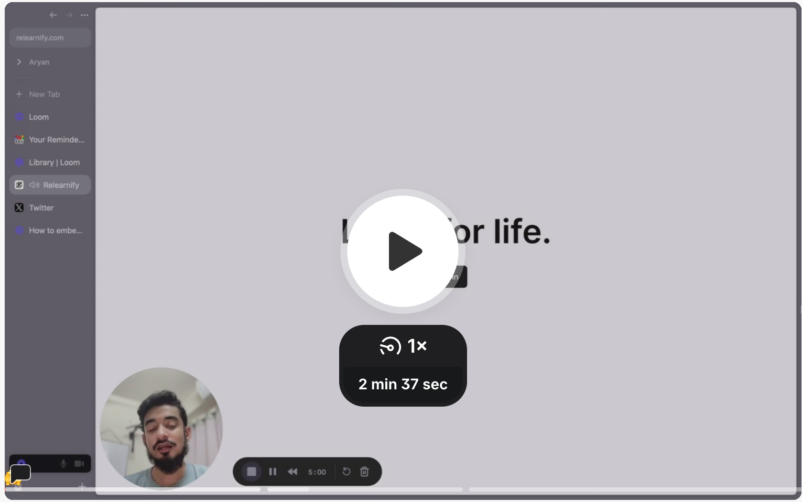
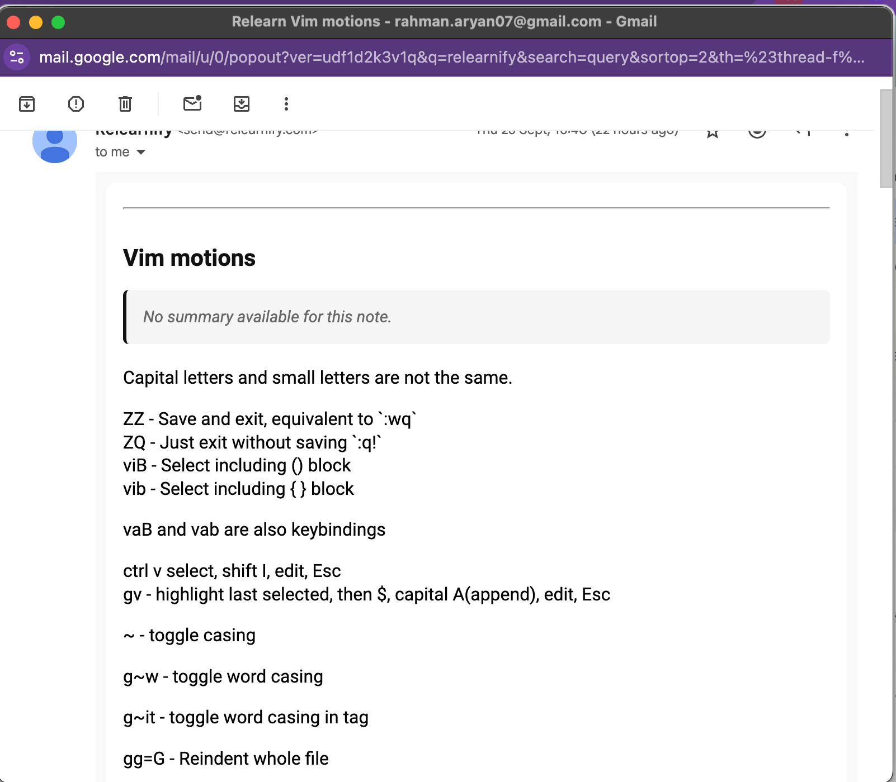

## **Relearnify | A smart notes app to improve memory retention with scheduled reviews**

My Role: Founder & Engineer | Team Size: 1 | Timeline: 3 Months
Tech Stack: `TypeScript` `React` `Next.js` `tRPC` `Redis` `BullMQ` `PostgreSQL` `Gemini`

---

## **The Problem**

Users take notes but often forget to review them, leading to poor knowledge retention. This makes the act of note-taking inefficient without a system for automated, timed reminders.

## **The Solution**

I built a web app that schedules note reviews using a spaced repetition algorithm. It sends daily emails with notes to review, turning passive note-taking into an active learning process.

You can play around with it here: https://relearnify.vercel.app/

An old demo of the app:

An example of the email sent by Relearnify:

## **Impact & Results**

- Increased potential memory retention by up to 70% using the FSRS algorithm.
- Automated the delivery of ~240 review emails monthly with a background job queue using Vercel.
- Added a Gemini API-powered summarization feature to quickly condense long notes.

## **Key Takeaways**

- A note-taking app can have many small UX features that are only noticeable when they're not there. Precision is key here.
- Learned to integrate external APIs (Google Gemini, Resend, Tiptap).

## **Technical Challenges & Decisions**

- There were quite a few challenges like properly using Tiptap and FSRS. Even though I used well known libraries, still the APIs needed context and there was a lot of digging to do. I also monkeypatched some of Tiptap's APIs so I can use links instead of embeds for YouTube videos in my notes.

- Working on a second iteration for Relearnify after my learnings with the first one, that will primarily be an offline-first note-taking application.

## **Links**

- https://relearnify.vercel.app/
