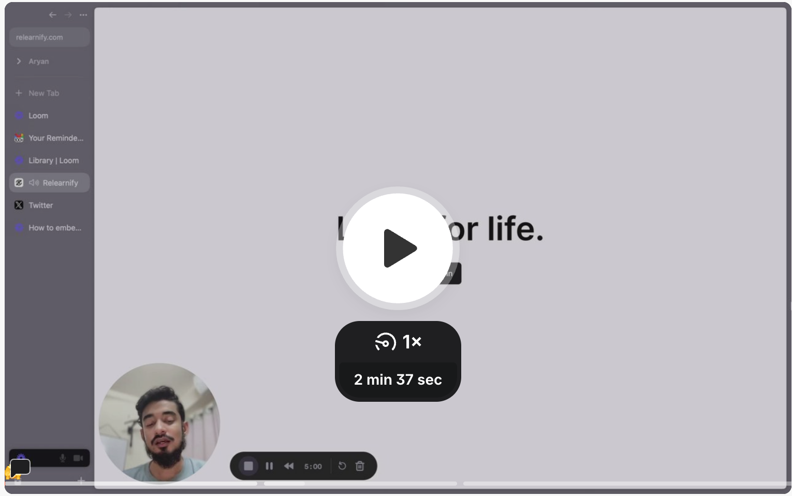
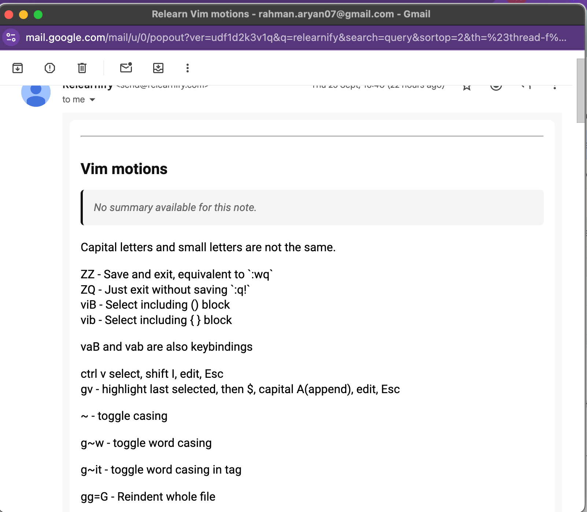

A notes app that emails you what to review. You write notes once, and the app nudges you later when it’s actually worth revisiting.

## TL;DR

- Rich-text notes + FSRS scheduling + daily review emails.
- Key implementation areas: a Tiptap patch, background jobs, and a one-click “summarize” flow for long notes.

**Tech Stack:** `Next.js` `tRPC` `PostgreSQL` `BullMQ` `Tiptap` `Gemini API`

**Try it:** [relearnify.vercel.app](https://relearnify.vercel.app/)

### How it works (the simple version)

1. You write a note (Tiptap editor).
2. FSRS schedules when you should see it again.
3. A background queue sends you a daily email with “today’s reviews”.

### Implementation details that took more effort

**Tiptap patching.** Tiptap’s default YouTube embed is an iframe. The extension node view was patched to render a styled link instead (lighter UI, fewer distractions).

**FSRS integration.** The scheduling model has state (stability, difficulty, retrievability). The real work is persisting that per note and not breaking it when notes change.

**Summarization.** Long notes get a “summarize” button (Gemini). It is a practical shortcut during review of dense material.

### What I learned

Note-taking UX has many invisible details. Keyboard shortcuts, paste handling, list indentation, and mobile responsiveness only become visible when they break. A significant part of the effort went into these edge cases.

### What’s next

Working on v2 as an offline-first app. The current version needs internet for everything. Local-first with sync would be more resilient.

## Links

- **Live:** [relearnify.vercel.app](https://relearnify.vercel.app/)
